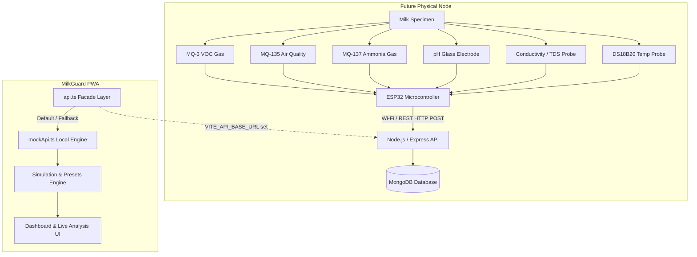

# MilkGuard – Smart Milk Quality Verification System

> **Tagline:** Smart Multi-Sensor Milk Quality & Spoilage Verification Progressive Web App (PWA)

MilkGuard is an IoT hardware-companion Progressive Web App engineered to interface with a multi-sensor verification station for rapid grading of raw and processed milk specimens.

---

## 🥛 Project Overview & Purpose

MilkGuard addresses critical challenges in dairy quality control by evaluating two **independent quality parameters**:
1. **Spoilage Classification:** Evaluates microbial activity and lactic acid fermentation via volatile headspace gases (**MQ-3**, **MQ-135**, **MQ-137**), **pH**, and **Temperature**.
   - Output States: `GOOD` | `SPOILING` | `SPOILED`
2. **Adulteration Classification:** Evaluates water dilution, added chemical neutralizers (alkaline buffers), or ionic solute additives via **Conductivity / TDS** and **pH**.
   - Output States: `NOT DETECTED` | `DETECTED`
3. **Composite Quality Score:** Calculated algorithmically between **0% and 100%**.

---

## ⚡ Current Status & Architecture

| Component | Status | Description |
| :--- | :--- | :--- |
| **Frontend PWA** | ✅ **Implemented** | React 19 + TypeScript + Vite + Tailwind CSS + Recharts + PWA Offline Shell |
| **Sensor Simulator** | ✅ **Implemented** | Real-time jitter stream, specimen presets (*Good*, *Spoiling*, *Spoiled*, *Adulterated*), 4-stage acquisition cycle |
| **Mock API Layer** | ✅ **Implemented** | Decoupled asynchronous service in `src/services/mockApi.ts` with localStorage persistence |
| **ESP32 Hardware** | ⏳ **Future Phase** | Multi-channel ADC microcontroller node with gas chamber & electrodes |
| **Backend REST API**| ⏳ **Future Phase** | Node.js / Express REST API endpoints |
| **MongoDB Database**| ⏳ **Future Phase** | Telemetry time-series and batch document store |

### System Architecture Pipeline



---

## 🚀 Demonstration Flow (College Review Walkthrough)

To deliver a complete interactive demonstration:
1. **Launch Dashboard (`/`):** Observe the active node indicator `MG-001`, current sensor readings, and the latest verified milk specimen.
2. **Open Live Analysis (`/live`):**
   - Note the **"SIMULATION MODE – Hardware sensor not connected"** indicator.
   - Select the **"Good Milk"** preset → observe real-time sensor streams (pH: 6.62, MQ-137: ~85, Conductivity: ~4.75 mS/cm).
   - Click **[ START ANALYSIS ]** → watch the 4-stage sampling animation (Headspace purge → Thermalization → Acquisition → Classification).
   - Verify Result: `Spoilage: GOOD`, `Adulteration: NOT DETECTED`, `Quality Score: 94%`.
3. **Simulate "Spoiling Milk":**
   - Select the **"Spoiling Milk"** preset.
   - Click **[ START ANALYSIS ]**.
   - Result shifts to: `Spoilage: SPOILING`, `Adulteration: NOT DETECTED`, `Score: ~70%`.
4. **Simulate "Adulterated Milk":**
   - Select **"Adulterated Milk"** preset.
   - Click **[ START ANALYSIS ]**.
   - Result shifts to: `Adulteration: DETECTED` (High conductivity / abnormal pH), `Score: ~45%`.
5. **Inspect Test History (`/history`):**
   - Filter by `All`, `Good`, `Spoiling`, `Spoiled`, or `Adulterated`.
   - Search by Test ID or Batch ID.
   - Export test history to CSV.
6. **Open Test Details (`/history/:id`):**
   - Inspect the 10-second multi-sensor response curve chart, telemetry snapshot, and export test JSON.
7. **Inspect Batch Management (`/batches`):**
   - View farmer origins (e.g. Green Valley Dairy, Sunrise Cooperative) and register new batches.
8. **View Device Status (`/device`):**
   - Inspect simulated battery level (84%), Wi-Fi signal, and run the **Diagnostics Self-Test**.
9. **View Analytics (`/analytics`):**
   - View quality trends over time, spoilage distribution donut chart, and adulteration breakdown.

---

## 🛠️ API Design & REST Endpoints (Ready for Backend)

When the Node.js / Express backend is connected, set `VITE_API_BASE_URL` in `.env`. The frontend will automatically route requests to:

| HTTP Method | Endpoint | Description |
| :--- | :--- | :--- |
| `GET` | `/api/readings/latest` | Fetch the most recent verified specimen reading |
| `GET` | `/api/readings` | Query test history with filtering and search |
| `GET` | `/api/readings/:id` | Fetch detailed reading with time-series curves |
| `POST` | `/api/readings` | Post a new test reading from ESP32 or station |
| `GET` | `/api/batches` | List all milk lots and batches |
| `POST` | `/api/batches` | Register a new collection batch |
| `GET` | `/api/devices/:id` | Fetch microcontroller health and sensor status |
| `GET` | `/api/analytics` | Aggregate quality summary and distribution metrics |

---

## 📱 Progressive Web App (PWA) Features

- **Offline Shell:** Caches UI assets via Service Worker for offline accessibility.
- **Installable:** Meets PWA criteria with web app manifest and standalone display mode.
- **Responsive:** Mobile-first layout with bottom navigation dock and desktop sidebar.

---

## 💻 Local Development

```bash
# Install dependencies
npm install

# Start development server
npm run dev

# Build production bundle
npm run build
```
